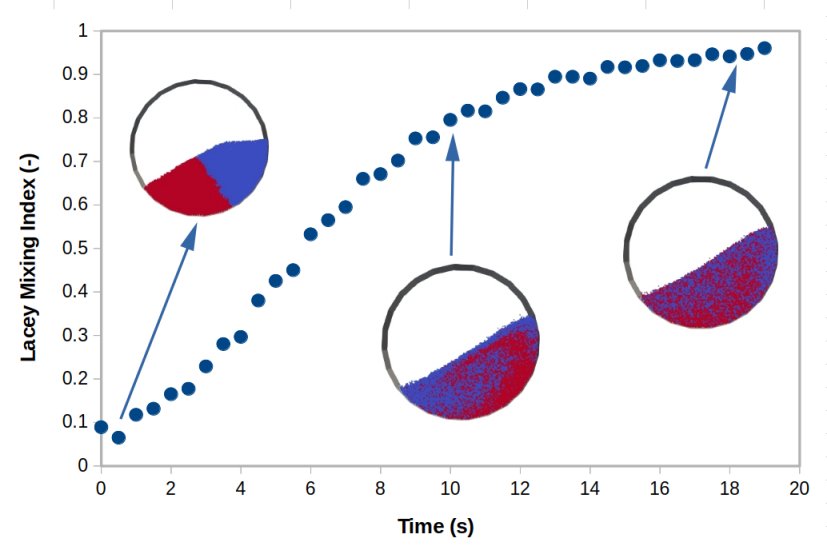

# Postprocessing to Calculate Lacey Mixing Index in a Rotating Drum (v-1.0)

## Problem Definition

This tutorial demonstrates how to use phasicFlow's mixing index postprocessing capabilities to evaluate mixing quality in granular flows. The case simulates a rotating drum with the following specifications:

- **Drum geometry**: Cylindrical drum with diameter of 0.24 m and length of 0.1 m
- **Rotation speed**: 11.6 rpm (1.214 rad/s)
- **Particle system**: 30,240 spherical particles with diameter of 4 mm
- **Particle types**: Two types of particles with identical physical properties but different identities for tracking mixing
- **Initial configuration**: Complete segregation with type 1 particles on the right half and type 2 particles on the left half of the drum

### Lacey Mixing Index

The Lacey mixing index is a statistical measure that quantifies the degree of mixing in a multi-component particulate system. It is defined as:

$$M = \frac{\sigma_0^2 - \sigma^2}{\sigma_0^2 - \sigma_r^2}$$

where:

- $M$ is the Lacey mixing index (dimensionless, ranging from 0 to 1)
- $\sigma^2$ is the observed variance of the concentration/fraction of one particle type across sample volumes
- $\sigma_0^2 = p(1-p)$ is the maximum variance corresponding to complete segregation
- $\sigma_r^2 = \frac{p(1-p)}{n}$ is the minimum variance corresponding to a completely mixed (random) state
- $p$ is the overall number fraction of type 1 particles in the system (0.5 in this case)
- $n$ is the average number of particles per sample region

#### Interpretation

- **M ≈ 0**: Complete segregation (particles of the same type are clustered together)
- **M ≈ 1**: Complete mixing (particles are randomly distributed)
- **0 < M < 1**: Partial mixing

As the drum rotates, particles initially segregated will gradually mix due to the tumbling motion. The Lacey mixing index provides a quantitative measure of this mixing process over time.

<div align="center">
<b>
    
A view of rotating drum
</b>
<b>



</b></div>

***

## Case Setup

This simulation setup is based on the [rotating drum small tutorial](../../sphereGranFlow/rotatingDrumSmall/README.md). The key requirement for mixing index calculations is to have **two distinguishable particle types** with a known composition ratio.

### Defining Particle Types for Mixing Analysis

For mixing index calculations, you need:

1. **Two particle types** defined in `caseSetup/shapes`:
   ```C++
   names       (sphere1 sphere2);
   diameters   (0.004 0.004);
   materials   (prop1 prop1);
   ```
   - Each shape gets a unique `shapeIndex` (0 for sphere1, 1 for sphere2)
   - Physical properties can be identical or different

2. **Initial segregated configuration** in `settings/particlesDict`:
   ```C++
   setFields
   {
       defaultValue 
       {
           shapeName   word    sphere1;
       }

       selectors
       {
           shapeAssigne
           {
               selector    box;
               boxInfo
               {
                   min (-0.1 -0.1 0.0);
                   max ( 0.0  0.1 0.1);
               }
               fieldValue
               {
                   shapeName   word sphere2;
               }
           }
       }
   }
   ```
   - Creates initial segregation (e.g., left half = sphere2, right half = sphere1)
   - Initial segregation is not mandatory but helps demonstrate mixing evolution from M ≈ 0

3. **Generate particles**:
   ```bash
   particlesPhasicFlow
   ```

### Configuring the Lacey Mixing Index Postprocessing

The Lacey mixing index is calculated as a postprocessing operation during the simulation. The configuration is specified in the `postprocessDataDict` file located in the `settings` folder. For complete documentation on the postprocessData module in phasicFlow, see the [PostprocessData readme](./../../../src/PostprocessData/readme.md).

#### Understanding the Configuration

In the `mixingInedexCalc` component, the following settings control the mixing index calculation:

- **processMethod = mixingIndex**: Activates the mixing index calculation algorithm
- **processRegion = rectMesh**: Divides the domain into a rectangular mesh for sampling
- **indexType = Lacey**: Specifies the Lacey mixing index formulation

The `rectMeshInfo` subdictionary defines the sampling mesh:
- `min` and `max`: Bounds of the sampling region (slightly larger than drum to capture all particles)
- `nx`, `ny`, `nz`: Number of divisions in each direction (15×15×8 = 1,800 cells)
- Each cell serves as a sample volume for measuring local particle concentrations

The `LaceyInfo` subdictionary contains critical parameters:
- **type1Frac = 0.5**: Overall number fraction of type 1 particles (must match actual 50/50 composition)
- **threshold = 20**: Minimum particles per cell for statistical reliability
- **type1Selection = equal**: Method for identifying type 1 particles
- **equalInfo**: Uses `shapeIndex == 0` to identify sphere1 particles as type 1

<div align="center"> 
in <b>settings/postprocessDataDict</b> file
</div>

```C++
runTimeActive       yes;

shapeType           sphere;

defaultTimeControl
{
    timeControl        simulationTime;
    startTime          0;
    executionInterval  0.5; 
}

components
(
    mixingInedexCalc
    {
        processMethod   mixingIndex;
        
        processRegion   rectMesh;
        
        indexType       Lacey;
        
        timeControl     default;

        precision 4;

        scientific no;

        rectMeshInfo 
        {
            min (-0.12 -0.12 0.00); // lower corner point of the box 
            max (0.12   0.12 0.11); // upper corner point of the box
            
            nx 15; // number of divisions in x direction
            ny 15; // number of divisions in y direction
            nz 8; // number of divisions in z direction 
        }

        LaceyInfo
        {
            type1Frac      0.5;
            threshold      20;
            type1Selection equal;

            equalInfo
            {
                field   shapeIndex;
                value   0;
            }
        }
        
    }    
```

### Enabling Postprocessing in the Simulation

To activate postprocessing during the simulation, ensure `settings/settingsDict` includes:

```C++
libs                ("libPostprocessData.so");
auxFunctions        postprocessData;
```

## Running the Simulation

Execute the simulation:

```bash
sphereGranFlow
```

The mixing index is calculated every 0.5 seconds during the simulation and results are written to the `postprocessData` folder.

## Understanding the Mixing Index Results

### Output File

The file `postprocessData/mixingInedexCalc.Start_0` contains:

**Header**: Complete `LaceyInfo` parameters and column descriptions

**Data Columns**:

1. **time**: Simulation time (s)
2. **numberOfSamples**: Number of cells with ≥ threshold particles (indicates mesh adequacy)
3. **avSampleSize**: Average particles per valid cell (should be stable and match expected values)
4. **LaceyMixingIndex**: Mixing quality (0 = segregated, 1 = perfectly mixed)

### Expected Evolution

- **t = 0**: M ≈ 0 (initial segregation)
- **Transient**: M increases as particles tumble and mix
- **Quasi-steady**: M reaches plateau (typically  above 0.8 for rotating drums, rarely 1.0)

### Key Analysis Points

**Monitor numberOfSamples**: Should remain relatively constant. If it drops significantly, either:
- Mesh is too fine (reduce nx, ny, nz)
- Threshold is too high (reduce threshold value)

**Check avSampleSize**: Should match expected value:
- Total particles ÷ numberOfSamples ≈ avSampleSize
- For this case: ~30,240 ÷ numberOfSamples
- If much lower than expected, particles may be leaving the sampling region

**Plot M vs time**: Create a time series plot to:
- Visualize mixing rate
- Identify characteristic mixing time (time to reach ~90% of final value)
- Detect anomalies or unexpected behavior

## Critical Parameters for Mixing Index Accuracy

### type1Frac (LaceyInfo)

**Must match actual composition**. Calculate as:

```
type1Frac = (number of type 1 particles) / (total particles)
```

For this case: 15,120 / 30,240 = 0.5

**Impact of errors**: Incorrect type1Frac will shift M values systematically.

### threshold (LaceyInfo)

**Guidelines**:

- **Too low (< 10)**: Cells with poor statistics create noise
- **Too high (> 50)**: Too many cells excluded, biased statistics
- **Recommended**: 10-50, depending on average cell occupancy

**Trade-off**: Higher threshold = more reliable statistics but fewer samples

### Mesh Resolution (rectMeshInfo)

**Target**: 20-50 particles per cell on average

Calculate average occupancy:
```
avg = total_particles / (nx × ny × nz)
```

For this case: 30,240 / (15 × 15 × 8) = 16.8 particles/cell

**Adjust if**:
- Too few particles/cell: Reduce divisions or increase threshold
- numberOfSamples too low: Coarsen mesh or reduce threshold

### type1Selection Method (LaceyInfo)

Choose the method that correctly identifies your type 1 particles:

- **equal**: Field exactly equals value (`shapeIndex == 0`)
- **lessThan**: Particles below threshold (`diameter < 0.003`)
- **greaterThan**: Particles above threshold
- **between**: Particles within range


## Troubleshooting Mixing Index Issues

| Issue | Likely Cause | Solution |
|-------|--------------|----------|
| M stays near 0 | No mixing occurring | Check rotation is active in geometryDict |
| M > 1 or M < 0 | Incorrect parameters | Verify type1Frac matches composition; check type1Selection logic |
| numberOfSamples very low | Mesh too fine or threshold too high | Reduce nx/ny/nz or reduce threshold |
| numberOfSamples drops over time | Particles leaving domain | Check rectMeshInfo bounds; verify geometry contains particles |
| Noisy M values | Insufficient statistics | Increase threshold or coarsen mesh |
| M constant despite mixing | Wrong particle selection | Verify type1Selection identifies correct particles |

## Additional Resources

- [Complete PostprocessData Documentation](./../../../src/PostprocessData/readme.md) - Full mixing index API and options
- [Rotating Drum Tutorial](../../sphereGranFlow/rotatingDrumSmall/README.md) - Basic case setup
